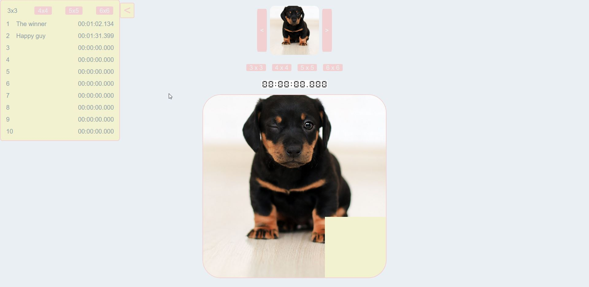

# ClickAndSlide

Simple 15 game in JavaScript

## Work
* when one of board size buttons are clicked, blocks are maked and mixed
* player can move only blocks near blank space
* when all blocks in correct position, player win

## TODO
* timer counting time
* saving records
* slider with other images

